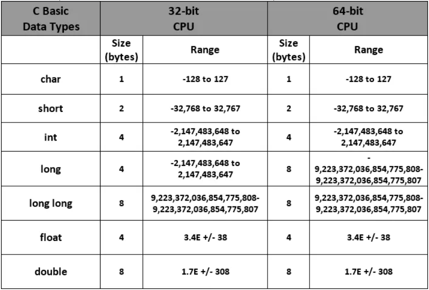
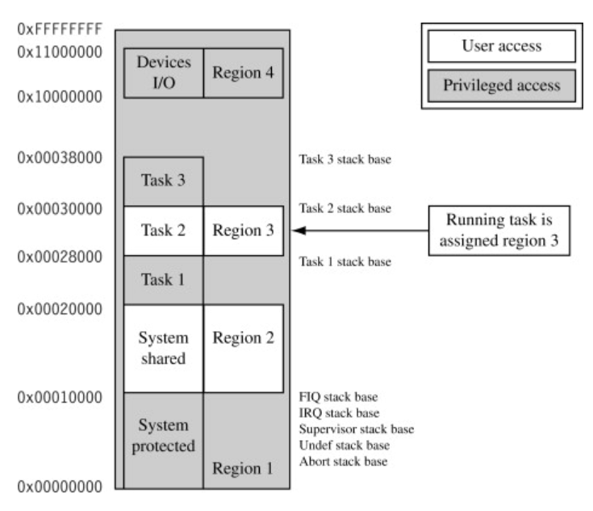
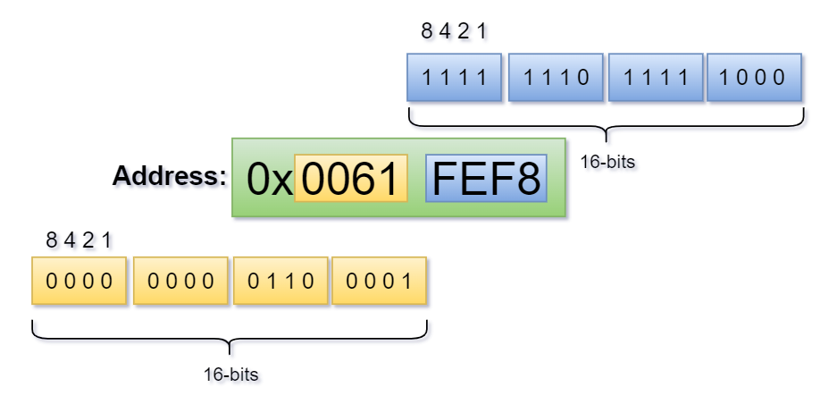
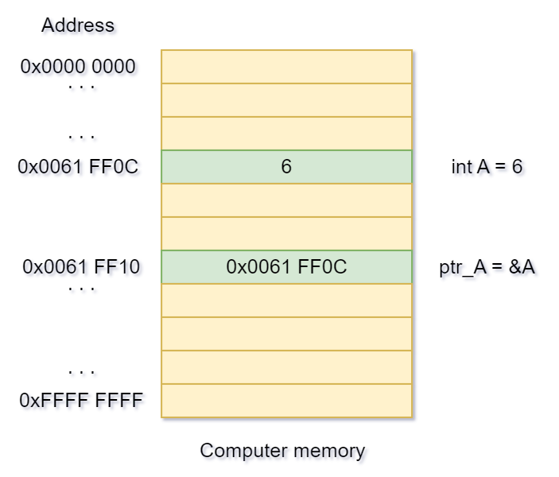
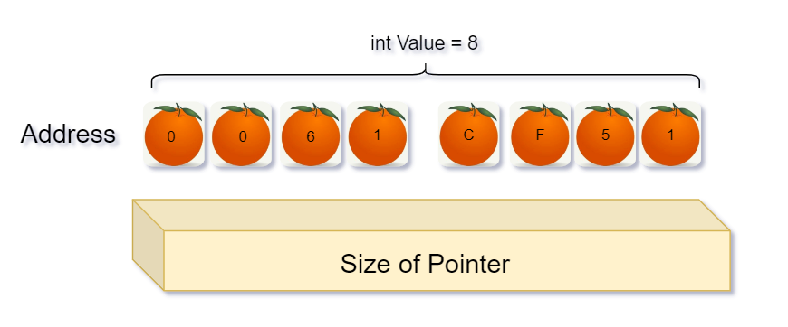

# Size of Pointer in C

Như khi ta học lập trình thì kích thước của từng loại kiểu dữ liệu được ghi rõ trong bảng dưới đây.

    

Khi nói đến hệ thống máy tính `32-bit` hay `64-bit` nghĩa là muốn nói đến `số bit` có thể được `xử lý đồng thời` bởi bộ xử lí - processor (CPU) của hệ thống máy tính đó.

## **Problem:** *Có khi nào bạn tự hỏi liệu rằng kích thước của 1 con trỏ (dùng để lưu trữ địa chỉ) trong C là bao nhiêu hay không ?* 

Pointer in C is just a variable that could store the address of the other variable. In C size of a pointer is not fixed as it depends on Word size of the processor. In general a 32-bit computer machine then size of a pointer would be 4 bytes while for a 64-bit computer machine, it would be 8 bytes.

## Chúng ta sẽ bàn về 32-bit computer machine:

- Giả sử: Computer memory có địa chỉ 0x0000 0000 đến 0xFFFF FFFF.

    

-  `Mỗi` chữ số hoặc chữ cái trong địa chỉ hex (từ 0 đến F) tương ứng với 4 bit. Vì vậy, khi có 8 chữ số hoặc chữ cái trong một địa chỉ, tức là  địa chỉ dài 32 bit.

----- Cho 1 cái hình ví dụ ở đây cho dễ hình dung ------

`Address: 0x0061 EFF8`

    

Khi ta khai báo 1 biến bất kì thì nó sẽ được lưu trữ tại 1 vị trí trong bộ nhớ máy tính. (Địa chỉ của biến này nằm trong khoảng 0x0000 0000 -> 0xFFFF FFFF).

Giả sử: 
- Khai báo:
  ~~~cpp
     int A = 6 => địa chỉ của biến A là 0x0061 FF0C.

     //Có 2 cách khai báo:
     C1: int *ptr_A = &A
     C2: int *ptr_A;
         ptr_A = &A;
     //Chú thích thêm:
      - ptr_A là địa chỉ biến A (ptr_A = 0X0061 FF0C)
      - *ptr_A là giá trị tại dịa chỉ biến A (*ptr_A = 6)
               
     
  ~~~
- Lúc này tại vị trí: `0x0061 FF0C` có giá trị = 6.

    

- Để có thể lưu địa chỉ này vào con trỏ ptr_A thì nó phải có 4 byte để có thể chứa được để chỉ này.
Để hình dung cho dễ hiểu là như này:

Ví dụ: Ta có số quả cam được đánh dấu lần lượt là `0 0 6 1 C F 5 1` tượng trưng cho `địa chỉ`, `tổng số lượng của số quả cam này là 8` tượng trương cho `giá trị tại địa chỉ đó`.

=> Vậy để cần chứa được 6 quả cam này ta cần 1 hộp đựng 8 ô trống để lưu trữ. Không thể dùng 1 hộp có số lượng < 8 để chứa được => Sẽ gây tràn.

    

`Note`: **Size of pointer** không phụ thuộc và kiểu dữ liệu của biến mà nó phụ thuộc vào kiến trúc hệ thống.
